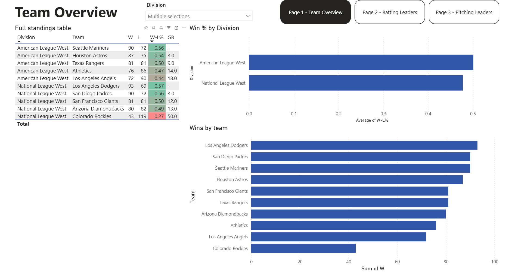
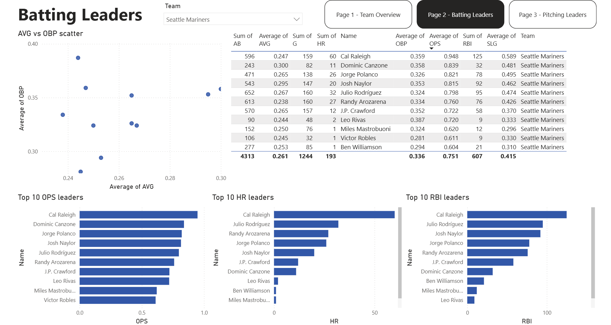
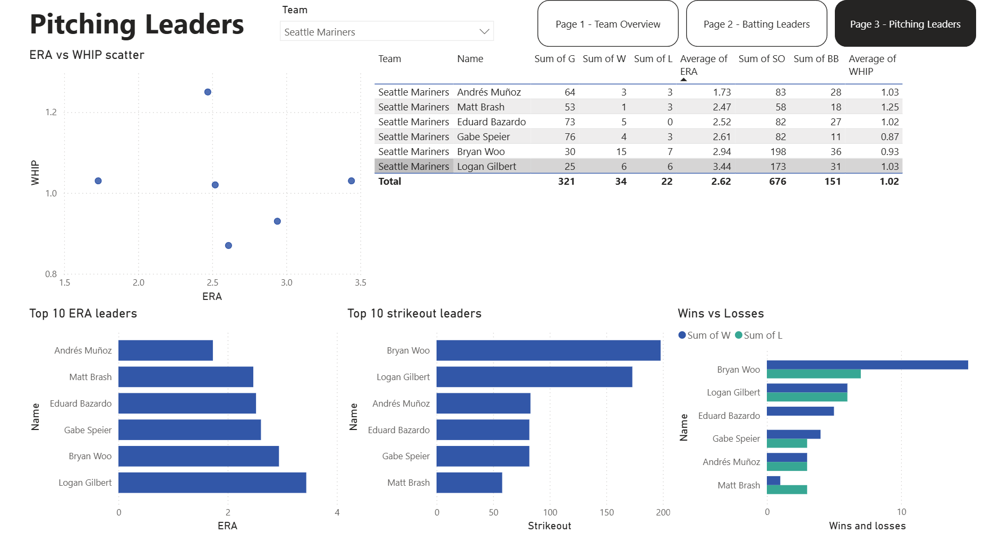

# MLB 2025 Season Performance Dashboard

## Overview
An interactive Power BI dashboard built on 2025 MLB season data pulled from the official MLB Stats API. The project covers team standings, individual batting leaders, and pitching leaders across all 30 MLB teams. Data is collected and cleaned with Python, then visualized in a three-page Power BI report.
## Dashboard Preview
### Team Overview

### Batting Leaders

### Pitching Leaders

## Tech Stack
- **Python 3.12** — data collection and cleaning
- **statsapi** — official MLB Stats API wrapper (no scraping)
- **pandas** — data manipulation and CSV export
- **Power BI Desktop** — interactive dashboard

## Project Structure
MLB_stats/

├── data/

│   ├── raw/                  ← untouched API responses saved as CSV

│   └── processed/            ← cleaned CSVs loaded into Power BI

├── scripts/

│   ├── collect_data.py       ← pulls batting, pitching, and standings data

│   └── clean_data.py         ← selects columns, renames, filters, exports

├── powerbi/

│   └── MLB_Dashboard.pbix

├── screenshots/

├── requirements.txt

└── README.md

## Data Source
All data comes from the **official MLB Stats API** via the
[`statsapi`](https://github.com/toddrob99/MLB-StatsAPI) Python library.

- **Batting:** qualified hitters with ≥ 50 at-bats (2025 season)
- **Pitching:** qualified pitchers with ≥ 10 innings pitched (2025 season)
- **Standings:** all 30 teams across 6 divisions (AL + NL)

## How to Run
1. Clone the repository

git clone https://github.com/Chirek/MLB_stats.git

3. Install dependencies

pip install -r requirements.txt

4. Collect raw data

python scripts/collect_data.py

This populates `data/raw/` with three CSV files.

6. Clean the data

python scripts/clean_data.py

This populates `data/processed/` with three cleaned CSV files.

8. Open the dashboard
- Open `powerbi/MLB_Dashboard.pbix` in Power BI Desktop
- If prompted, update the data source path to your local `data/processed/` folder
- Click **Refresh**

## Key Insights
- The Seattle Mariners led the AL West with a .556 win percentage
- The Milwaukee Brewers led all of MLB with 97 wins
- Cal Raleigh led the Mariners in OPS, HR, and RBI

## License
Copyright 2026 Krisztián Németh

Permission is hereby granted, free of charge, to any person obtaining a copy of this software and associated documentation files (the “Software”), to deal in the Software without restriction, including without limitation the rights to use, copy, modify, merge, publish, distribute, sublicense, and/or sell copies of the Software, and to permit persons to whom the Software is furnished to do so, subject to the following conditions:

The above copyright notice and this permission notice shall be included in all copies or substantial portions of the Software.

THE SOFTWARE IS PROVIDED “AS IS”, WITHOUT WARRANTY OF ANY KIND, EXPRESS OR IMPLIED, INCLUDING BUT NOT LIMITED TO THE WARRANTIES OF MERCHANTABILITY, FITNESS FOR A PARTICULAR PURPOSE AND NONINFRINGEMENT. IN NO EVENT SHALL THE AUTHORS OR COPYRIGHT HOLDERS BE LIABLE FOR ANY CLAIM, DAMAGES OR OTHER LIABILITY, WHETHER IN AN ACTION OF CONTRACT, TORT OR OTHERWISE, ARISING FROM, OUT OF OR IN CONNECTION WITH THE SOFTWARE OR THE USE OR OTHER DEALINGS IN THE SOFTWARE.

